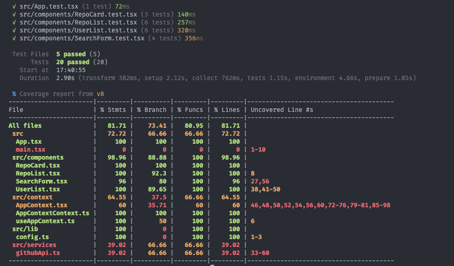

# GitHub Repositories Explorer

A modern web application built with React, TypeScript, and Vite that allows users to explore GitHub repositories. This application provides a seamless experience for searching GitHub users and viewing their public repositories.

Demo Link : https://github-repositories-explorer-pi.vercel.app/

## Features

- 🔍 Search GitHub users by username (partial or complete)
- 👥 View up to 5 matching GitHub user results
- 📦 Browse all public repositories of selected users
- 🎨 Modern UI with Tailwind CSS
- ⌨️ Keyboard navigation support
- ⚡ Fast and responsive design

## Tech Stack

- ⚛️ React with TypeScript
- 🚀 Vite for fast development and building
- 🎨 Tailwind CSS for styling
- 🔄 React Context API for state management
- 🧪 Vitest + React Testing Library for testing

## Getting Started

### Prerequisites

- Node.js
- npm or yarn

### Installation

1. Clone the repository:
```bash
git clone https://github.com/ahmadlufiau/github-repositories-explorer.git
cd github-repositories-explorer
```

2. Install dependencies:
```bash
npm install
# or
yarn install
```

3. Start the development server:
```bash
npm run dev
# or
yarn dev
```

The application will be available at `http://localhost:5173`

### Running Tests

General Test

```bash
npm test
# or
yarn test
```

Coverage Test
```bash
npm run test:coverage
# or
yarn test:coverage
```

## Project Structure

```
src/
├── components/         # React components
│   ├── SearchForm.tsx  # Search input and button
│   ├── UserList.tsx    # User search results
│   ├── RepoList.tsx    # Repository list
│   └── RepoCard.tsx    # Individual repository card
├── context/           # React Context for state management
├── services/          # API services
│   └── githubApi.ts   # GitHub API integration
└── App.tsx           # Main application component
```

## API Integration

This application uses the GitHub REST API v3 [API Docs URL](https://docs.github.com/en/rest?apiVersion=2022-11-28):
- User search: `GET https://api.github.com/search/users?q={username}&per_page=5`
- User repositories: `GET https://api.github.com/users/{username}/repos`

## Screenshot
### Screenshot 1


### Screenshot 2


### Screenshot 3


### Test Coverage

